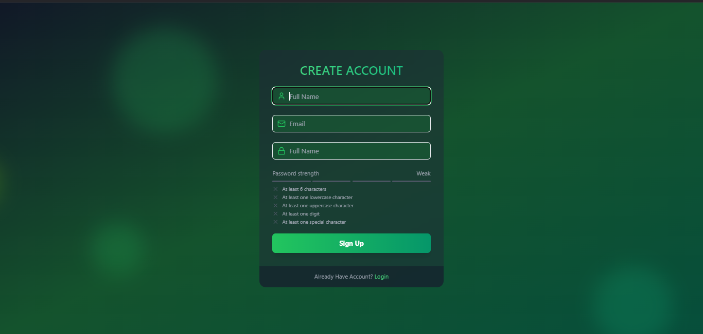
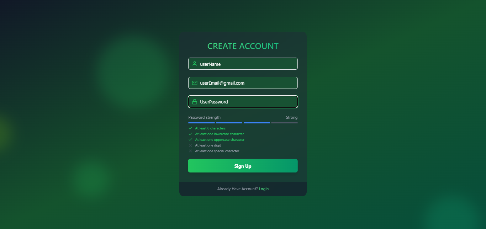
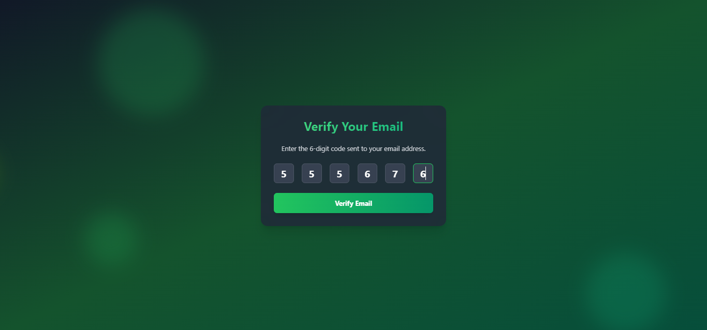

# Advanced MERN Authentication

This repository contains an advanced authentication system built with the MERN (MongoDB, Express.js, React, Node.js) stack. The system supports features such as user registration, email verification, login, and token-based authentication.

## Features

- **Registration**: Users can register by providing a name, email, and password.
- **Email Verification**: Users receive a verification code to activate their account.
- **Login**: Secure login system with JWT tokens.
- **State Management**: Utilizes [Zustand](https://github.com/pmndrs/zustand) for efficient state management.
- **Password Validation**: Password strength meter and rules for strong passwords.
- **Animations**: Smooth animations provided by [Framer Motion](https://www.framer.com/motion/).
- **Cookies**: Stores user tokens securely in cookies for session management.

## Screenshots

### Logain Page


### Registration Page


### Password Validation


### Email Verification


## Technologies Used

### Frontend
- React
- Zustand (State Management)
- Framer Motion (Animations)
- Tailwind CSS

### Backend
- Node.js
- Express.js
- MongoDB
- JWT (JSON Web Token)
- Cookies for token storage

## Setup Instructions

1. Clone the repository:
   ```bash
   git clone https://github.com/kimbo-slicee/Advanced-MERN-Auth.git
   ```
2. Navigate to the project directory:
   ```bash
   cd Advanced-MERN-Auth
   ```
3. Install dependencies for the backend:
   ```bash
   cd backend
   npm install
   ```
4. Install dependencies for the frontend:
   ```bash
   cd ../frontend
   npm install
   ```
5. Set up environment variables:
    - Create a `.env` file in the `backend` directory.
    - Add the following variables:
      ```env
      MONGO_URI=your_mongodb_connection_string
      JWT_SECRET=your_jwt_secret
      ```
6. Start the development server:
    - Backend:
      ```bash
      cd backend
      npm start
      ```
    - Frontend:
      ```bash
      cd frontend
      npm start
      ```

## Folder Structure

```
Advanced-MERN-Auth/
|-- backend/
|   |-- models/
|   |-- routes/
|   |-- controllers/
|   |-- utils/
|   `-- server.js
|
|-- frontend/
|   |-- src/
|       |-- components/
|       |-- pages/
|       |-- store/ (State management with Zustand)
|       `-- App.js
```

## License

This project is licensed under the MIT License. Feel free to use and modify the code for your own purposes.
